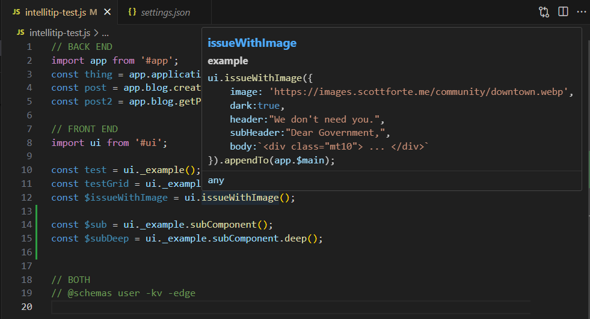
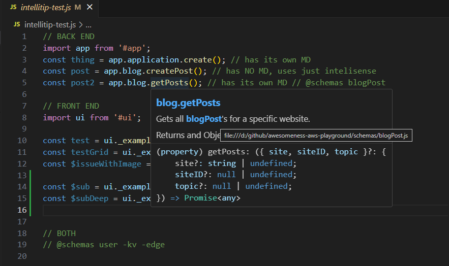
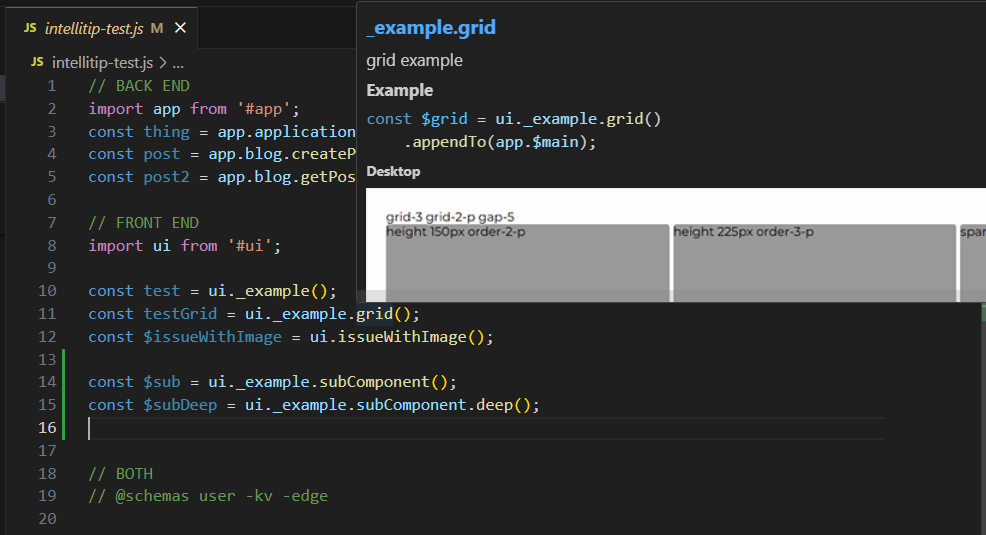
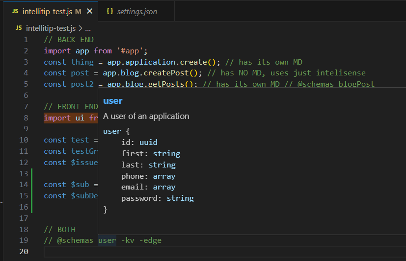
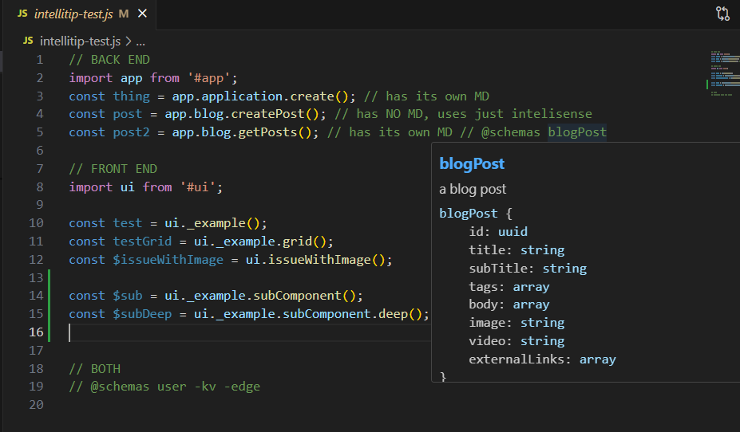
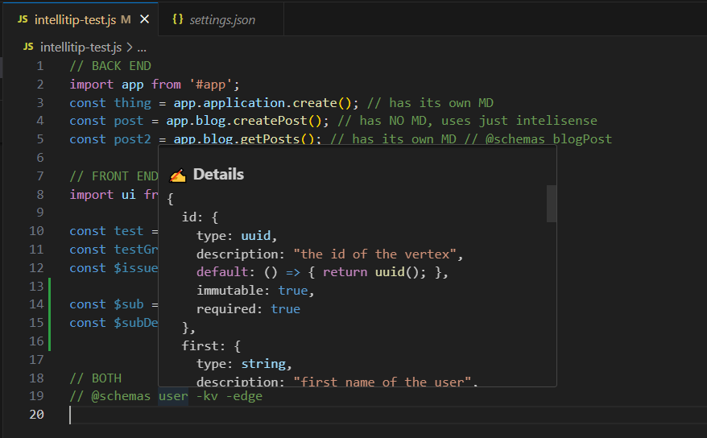
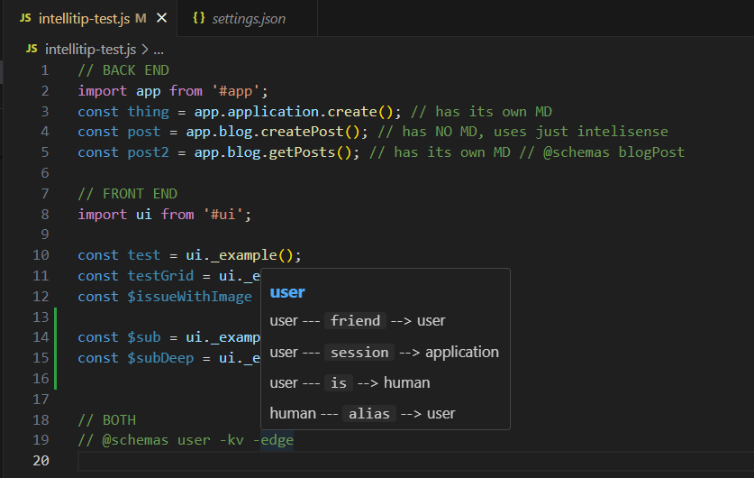
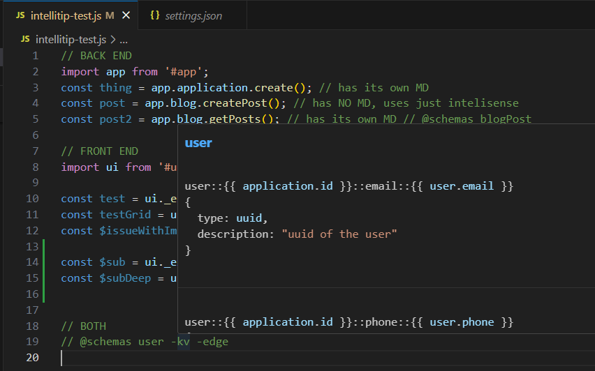

# Awesomeness Tooltip - VS Code Extension

## 📌 Overview
Awesomeness Tooltip is a Visual Studio Code extension that provides helpful tooltips for JavaScript files. It extracts schema information based on configured path aliases and displays detailed hover tooltips, making it easier to understand object structures and relationships within your project.

Provides way more information than the default hover, intellisense, or peek definition (even with TS).


## 🚀 Features
- 📝 **Hover Tooltips**: Displays structured tooltips with schema descriptions, properties, edges, and related key-value pairs.
- 🔄 **Dynamic Schema Loading**: Fetches schema information dynamically from configured paths.
- 🖥 **Customizable Configuration**: Supports custom path mappings for schema locations.
- 📡 **Efficient Caching & Watching**: Utilizes caching and file watching to enhance performance.
- 📢 **Debugging Output Channel**: Provides logs in a dedicated "Awesomeness Tooltip" output channel.

## 🛠 Configuration

There are 2 places you can define a config
1. Project config file: `.awesomeness/config.js` (preferred)
2. VS Code settings: `settings.json` (fallback)

This extension requires configuring path aliases to locate schema files. You can set these mappings in your VS Code settings (`settings.json`):

### Example .vscode/settings.json

```js
export default {
    debug: true,
    schemas: {
      "@schemas": "schemas"
    },
    components: {
        "ui": [ // can be array or string
            "awesomeness-ui/components", 
            "awesomeness-ui/components2"
        ],
        "app": "api/functions" // can be simple string
    },
    componentLocations: (site) => {
        // build a site-specific base URL relative to the config file
        const siteURL = new URL(`../sites/${site}/`, import.meta.url);
        return [
        new URL('./components/', siteURL), // site-first
        new URL('../awesomeness-ui/components/', import.meta.url) // fallback
        ];
    }
};
```

**Project Config: componentLocations**

- **Signature:** `componentLocations(site)` — the loader will call this with the detected `site` string (or `null` when no site can be determined).
- **Return value:** an Array of `URL` objects (preferred). Returning `URL` objects avoids ambiguity and path resolution issues; strings are tolerated but less robust.
- **Behavior:** the loader prefers the returned locations (first match wins). Items outside the workspace are filtered out and logged. If `site` is `null`, site-specific locations should be skipped.


This contract keeps `componentLocations` simple and explicit: implementors construct proper `URL` values and the extension converts and validates them.


### Example .vscode/settings.json

```json
{
  "awesomeness": {
    "schemas": { // will look for a file in that directory with the target name
      "@schemas": "schemas"
    },
    "components": {
      // can be a single string or an array of paths (first match wins)
      "ui": ["awesomeness-ui/components", "awesomeness-ui/components2"],
      "app": "api/functions"
    }
  }
}
```

## 🎯 Usage

If you're using `awesomeness-ui` components or `awesomeness-api/routes`, each component or route should ideally live in its own folder with either a `readme.md` or `_info.js` file to describe it.


**Project config loading (priority)**

The extension prefers a project config file at `.awesomeness/config.js` as the primary configuration source. If that file is absent, workspace `settings.json` (`awesomeness` section) is used as an optional fallback. When both exist, project config values override workspace settings. The check below:

---


### 📚 File Resolution Priority

For **components** (like those in `awesomeness-ui/components` or `api/functions`):

- If the reference is shallow (e.g. `ui._example()`):
  1. `awesomeness-ui/example/readme.md`
  2. `awesomeness-ui/example/_info.js`

- If the reference is nested (e.g. `ui._example.subComponent()`):
  1. `awesomeness-ui/example/subComponent.md`
  2. `awesomeness-ui/example/subComponent/readme.md`
  3. `awesomeness-ui/example/subComponent/_info.js`

For **schemas** (like those in `schemas`), the lookup directly resolves to:
- `schemas/mySchema.js`


### 🧑‍💻 Example Usage
```js
// FRONT END
import ui from '#ui';

// will look for:
// 1. awesomeness-ui/example/readme.md
// 2. awesomeness-ui/example/_info.js
const test = ui._example();

// will look for:
// 1. awesomeness-ui/example/subComponent.md
// 2. awesomeness-ui/example/subComponent/readme.md
// 3. awesomeness-ui/example/subComponent/_info.js
const testGrid = ui._example.subComponent();

// will look for:
// 1. awesomeness-ui/example/subComponent/deep.md
// 2. awesomeness-ui/example/subComponent/deep/readme.md
// 3. awesomeness-ui/example/subComponent/deep/_info.js
const $subDeep = ui._example.subComponent.deep();
```

### Basic Example


### Backend Component


### Component with Image



## 📑 Schemas
While Schemas can be any object structure, the following keys have special meaning and display in the hover:
 - **name**: the name of a schema
 - **description**: the description of a schema
 - **properties**: the properties of a schema
 - **edges**: the edges of a schema (vertices that are connected to this schema)
 - **relatedKVs**: the key-value pairs related to this schema

See [example schema](examples/schemas/user.js) for a full example.

# Example Hover Display

### user
A user of an application

```js

user { 
    id: uuid
    first: string
    last: string
    phone: array
    email: array
    password: string
 }

```



### Details
```js
{
  id: {
    type: uuid,
    description: "the id of the vertex",
    default: () => { return uuid(); },
    immutable: true,
    required: true
  },
  first: {
    type: string,
    description: "first name of the user",
    default: null,
    minLength: 1,
    maxLength: 100
  },
  last: {
    type: string,
    description: "last name of the user",
    default: null,
    minLength: 1,
    maxLength: 100
  },
  phone: {
    type: array,
    description: "phone numbers of the user",
    items: {
      $ref: "phone"
    }
  },
  email: {
    type: array,
    description: "email addresses of the user",
    items: {
      $ref: "email"
    }
  },
  password: {
    type: string,
    description: "hashed password of the user",
    default: null
  }
}

```



### Edges
user -- friend --> user




### Related KVs

```js 
user::{{ application.id }}::email::{{ user.email }}
{
  type: string,
  description: "uuid of the user",
  example: "00000000-0000-0000-0000-000000000000"
}

user::{{ application.id }}::phone::{{ user.phone }}
{
  type: string,
  description: "uuid of the user",
  example: "00000000-0000-0000-0000-000000000000"
}
```


