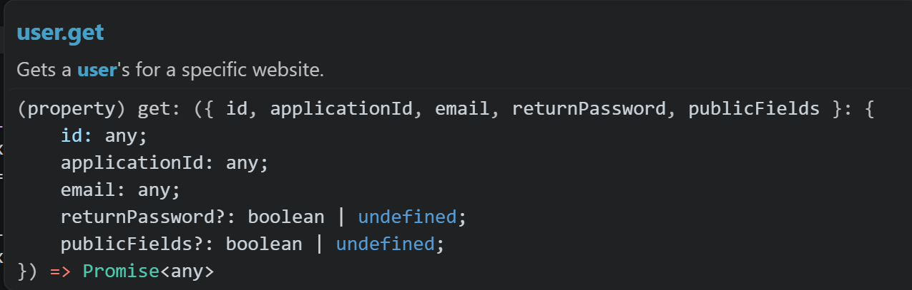
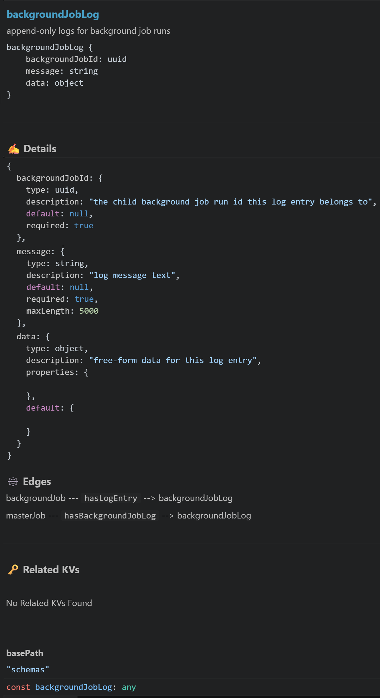
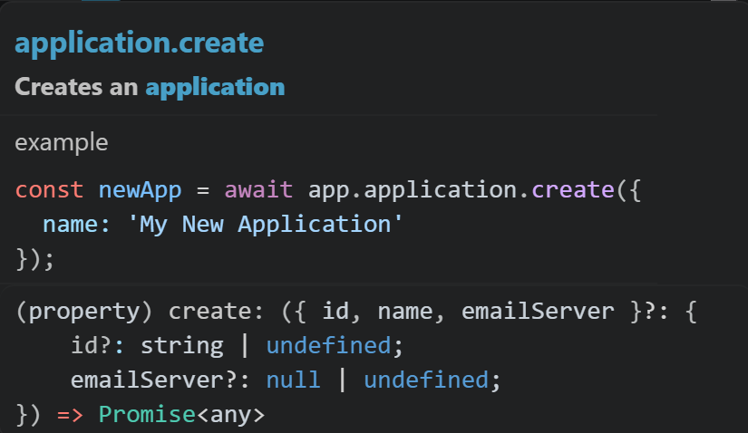
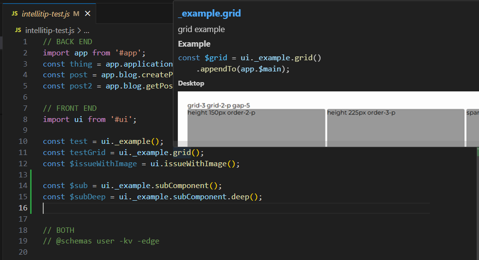

# Awesomeness Intellitip

## 🤯 Imagine a custom readme.md was available in a tooltip...

**Why was this not created before?** ... whatever I did it.

Tooltips should show **meaningful** documentation for whatever you are working with not just a type signature. This extension is a companion to [Awesomeness JS](https://awesomeness.js), but it can be used in any project.

> ...
> **(Quick plug for Awesomeness JS:)** it's a true **full stack** JavaScript framework for building modern web apps ready to be deployed as PWA's. Front-End, Back-End, API, API Docs, SDK, MCP Server, Agents... It's a no BS vanilla JS library with no frameworks, build steps, or transpilation. The key to success is organization and schemas every dev shares. **Everything boils down to schemas**
> ...

---

## 📐 Frame of Reference

When developing large enterprise applications, using the same language and meaning for a term is critical for speed, success, communication, and debugging. 

That's why people got tricked into using TS. They think they are safe, but TS does not exist in the runtime so you are really just slowing developers down and letting them get away with bad habits. The world does not need TS, we need to make sure everyone knows what `words` are _special_ and what they mean.

---

## What does this extension do?

Basically it allows you to hover over anything and see custom docs.

Works for
- Schemas
- Front-end components
- Back-end functions

The key again, is the entire team can depend on special words like `user` or `profilePage` and know exactly what they mean and how to use it. **Full blown pretty UI docs, not just a type signature or JSDoc markup.**

---

## 🚀 Basic Config

Let's assume you have a basic config...

For the awesomeness framework all files should live in the `.awesomeness` folder, but you can put your config anywhere. The important thing is to tell the extension where to find it.


#### Example `.awesomeness/config.js`

```js
export default {
    makeSchemaWordsSpecial: true,  // default is true (but here for clarity)
    schemas: {
        "@schemas": "schemas",
    },
    tipMap: {
        app: "api/functions",
        ui: ({ site }) => {

            return [
                new URL(`../sites/${site}/components/`, import.meta.url),
                new URL(`../awesomeness-ui/components/`, import.meta.url),
            ];
           
        }
    }
};
```

`tipMap` maps the word you hover from to the folder, folders, or function that can find its docs.

- Use a string for one static lookup folder.
- Use an array when several static folders should be searched in order.
- Use a function when the lookup folders depend on the current file, such as site-specific component overrides.

The function form receives `{ site }` and can return a string, a `URL`, or an array of strings and `URL`s:

```js
const componentLocations = ({ site }) => {
    return [
        new URL(`../sites/${site}/components/`, import.meta.url),
        new URL(`../awesomeness-ui/components-private/`, import.meta.url),
        new URL(`../awesomeness-ui/components/`, import.meta.url),
    ];
};
```

#### What does this do?

In the config above you told it your library/object/SDK is called `app`.

If you hover over `app` it will look in the `api/functions` folder and show the readme.md for the function you are hovering over.

**Quick note:** it will use readme.md by default but if you have multiple files in the folder it can use file specific md files too.

For example: `app.user.get` will look for both 
- `/api/functions/user/get/readme.md`
-  `/api/functions/user/get.md`

If you hover over `ui` it will look in the `site specific` components folder first, if it doesn't find it there, it will look in the common `awesomeness-ui/components` folder second, and so on.

This allows you to have a common set of components, but also allow for site specific overrides.


#### 🕺 Example: 

```js
const user = app.create('user', user);
```

#### Hovering over app.user.`get`
Because `get` has its own .md, located at `/api/functions/user/get.md` hovering over `get` will show:




#### 🧙 Hovering over `user` (a schema)

With `makeSchemaWordsSpecial: true` hovering over `user` will show the schema documentation from `/schemas/user.js`:

if you had makeSpecialWords = `false`... Intellitip still works but you need to make a comment like this
```js
// @schemas user
const user = app.user.get(id);
```

**How they render:** Schemas are not driven by .md files, but by the schema definition itself. (one less step for pretty docs). See example schema: [./_schemaTemplate.js](_schemaTemplate.js)

#### 👀 What does tooltip look like for a `Schema`?



Schemas can include these special keys, each will be rendered in a special way as you can see in the example above.

- `name`: schema name
- `description`: schema description
- `properties`: property definitions
- `edges`: connected vertices
- `relatedKVs`: related key-value pairs


---

## More Cool Examples


### 🤖 MD Files and Code examples

Copy and paste code example are not just good for human developers, it also works great with LLM's and agents.




## 🎨 For UI Components

Wouldn't it be nice if you could hover over a component and see its documentation **and examples**?




---

## Advanced - Not recommended

Regex triggers let you attach documentation to text that does not follow a fixed dot-separated path. Use a regex literal as a key in `tipMap` or `schemas`. The first capture group is used as the target name; for clearer patterns, use a named `target` capture group instead.

```js
export default {
    tipMap: {
        "/\\bapp\\.([A-Za-z_$][\\w$]*)\\s*\\(/": "api/functions",
        "/\\bservice\\.(?<target>[A-Za-z_$][\\w$]*)\\b/": "api/services",
    },
};
```

With this configuration, hovering over `create` in either example looks up the matching documentation target:

```js
app.create(user);
service.authenticate(user);
```

The first pattern captures `create` with `([A-Za-z_$][\\w$]*)`. The second captures `authenticate` with the named group `(?<target>...)`. The regex flags are optional, and the extension automatically enables the global (`g`) flag so multiple matches on the same line are supported. The cursor must be over the captured target for the tooltip to appear.

Regex keys can also be used for schema mappings:

```js
export default {
    schemas: {
        "/\\bmodel\\.(?<target>[A-Za-z_$][\\w$]*)\\b/": "schemas",
    },
};
```

---

## Philosophy

### Shared meaning beats clever code

Most software teams do not fail because nobody can write a function. They fail because the team stops sharing the same meaning for the words in that function. Is a `user` an account, a person, or an authenticated session? Is `profile` a database record, an API response, or a screen model? When those answers live in people's heads, every new developer, feature, and integration creates another opportunity for the system to drift.

Schemas make meaning explicit. They give the team a shared vocabulary for the data, relationships, properties, and rules that the product is built around. That vocabulary should be visible in the code, available at runtime, and easy to discover while someone is working. Documentation is not a separate report that gets written after the system; it is part of the system's structure.

### The startup version of technical debt

Startups commonly run into the same problems:

- The founder is the only person who knows what important words mean.
- A quick prototype grows into a product without a stable hierarchy.
- Every team invents its own names for the same concept.
- Documentation is postponed until onboarding, debugging, and support become painful.
- A type checker gives the team confidence while the runtime behavior and business meaning remain unclear.

Schema-driven documentation attacks these problems at their source. It turns tribal knowledge into shared project language, gives each concept a clear home, and makes the intended relationships discoverable. That reduces the cost of onboarding, makes code review more precise, and helps frontend, backend, API, SDK, and documentation teams work from the same definitions.

### Organization is a safety feature

Clear organization and hierarchy are not cosmetic preferences. They are how a growing system preserves context. A predictable folder structure, consistent names, and deliberate parent-child relationships tell people where a concept belongs and how it connects to everything around it. Once that structure is in place, tools like Intellitip can turn it into immediate, contextual documentation.

TypeScript can tell you that a value is supposed to have a shape at compile time. It cannot, by itself, tell the team what `user` means, whether the data came from the correct API, whether the runtime payload is valid, or where the concept belongs in the product hierarchy. Type safety is useful, but it is not a substitute for shared semantics, runtime validation, or disciplined organization. A beautifully typed mess is still a mess.

Do not be lazy about this part. Name things carefully. Put them where they belong. Define the relationships. Document the concepts that everyone depends on. Organize your shit before the codebase gets large enough to organize you.

